## Clinical ASsist Heuristic Early Warning System+
<div style="position: relative; text-align: center; margin-top: 5em;">
{fig-cap="" width=100% .no-dark}
</div>


 <div class="fragment fade-out" data-fragment-index="1" style="position:absolute; top:20%; left:50%; width:100%; height:60%; background:white; z-index:1;"></div> 

::: {.notes}
- Multiple model architectures, encompassing classical machine learning (ML) and Deep Learning (DL), were trained and evaluated using cross-validation and hyperparameter optimization. 
- Model selection was based on predictive performance and computational efficiency, with LightGBM identified as the most favorable trade-off. 
- The optimal model was evaluated by performing domain ablation and feature importance analysis with Shapley explanations. 
- Based upon continuous model outputs, an actional alarm system including specific alarming frameworks was evaluated. The slope coefficient and persistence quantify the increase in the probability of sounding an alarm. 
- An 8-hour silencing period is implemented to prevent alarm fatigue.
:::

## How well does it work?
<!-- Clinical ASsist Heuristic Early Warning System (CASHEWS) -->

::: {.columns}
::: {.column width="50%"}
<div style="position: relative; top: -1em;">

<div style="text-align: center; margin-top: -0em;">
  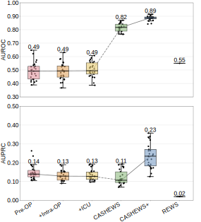
</div>
</div>
<div class="fragment fade-out" data-fragment-index="2" style="position:absolute; top:5%; left:25%; width:100%; height:70%; background:white; z-index:2;"></div>

:::
::: {.column width="50%" .fragment fragment-index="3"}
<div style="position: relative; top: -1em;">

<div style="text-align: center; margin-top: -0em;">
  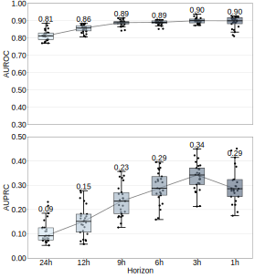
</div>
</div>
:::
:::

<div style="position: relative; top: -2.5em;">
::: {.fragment .fade-in fragment-index="2"}
- Remote Early Warning Score (REWS)^[[@vanderstamWearablePatchBased2023]] threshold-based wearable score.
- Dynamic models and wearable data improve performance.
:::
::: {.fragment .fade-in fragment-index="3"}
- Lead time performance has little drop-off.
:::
</div>


::: {.notes}
- Metrics: areas under the receiver operating characteristic (AUROC) and (b) boxplots of patient-level areas under the precision–recall curve (AUPRC) 
- First: the static baseline model that aggregate the data until the start of the surgery, then directly after the surgery and directly after the ICU stay. Static models using only preoperative and ICU data performed near chance level.
- Then the dynamic, longitudinal model that aggregates the data in 30-minute time windows. Where we have CASHEWS without wearable data and CASHEWS+ with wearable data. These models had much more predictive power for identifying surgical site infections.
- We also compare this with a baseline of the Remote Early Warning Score (REWS), which is a threshold-based wearable score.
- Looking at the lead time performance, we see that there is little drop-off in performance as we move further away from the clinical detection of the complication, which suggests that there are indicators of deterioration that can be detected well in advance of clinical recognition.
- Boxplots of AUROC and (d) boxplots of AUPRC of CASHEWS+ for varying lead times prior to clinical detection. The last hour was set to be positive, while all subsequent time windows were removed from training and evaluation.
- The key implication is that predictive surveillance can be extended beyond the ICU into general wards, where many actionable postoperative complications actually emerge.
:::

## Model Interpretation Grouped by Modality

<!-- <div style="text-align: center; margin-top: -5em;">

  
</div> -->
Fold-averaged, normalized, grouped model attributions according to Shapley values^[[@lundbergUnifiedApproachInterpreting2017a]]:
<div style="text-align: center; ">
  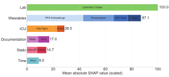
</div>

- Clinician: subtle physiological indicate early autonomic stress.

::: {.notes}
- Taking the common Shapley value approach for model interpretation, we can look at the importance ranking of modalities and their specific sub-features after normalization to laboratory values as the modality of highest importance.
- Importance ranking of modalities and their specific sub-features after normalization to laboratory values as the modality of highest importance
- A clinical interpretation of this is that subtle physiological changes are indicators of early autonomic stress, loss of physiological complexity, and impending decompensation or precursors to the surgical site infection.
- However, wearable modalities are a close second with core temperature, HRV features, and RR interval features being the top single contributors and the PPG embeddings accounting for a large portion of the overall contribution.

:::

<!--

<div style="text-align: center; margin-top: -2em;">
  
</div>

::: {.notes}
(a) Boxplots of areas under the receiver operating characteristic curve (AUROC) and (b) boxplots of patient-level areas under the precision–recall curve (AUPRC) for prediction performance of models after ablation of individual modalities. (c) AUROC and (d) AUPRC boxplots after addition of wearable-derived signal features (e) Receiver operating curve and (f) precision-recall curves comparing CASHEWS, CASHEWS+, and the remote early warning score (REWS). 
:::
-->

<!-- <div style="position:absolute; top:0%; left:0%; width:100%; height:60%; background:white; z-index:0;"></div> -->

## Alarm Strategy and Decision Curve Analysis

::: {.columns}
::: {.column width="30%"}
<div style="text-align: center; margin-top: -0em;">
*Alarm burden and precision-recall*

  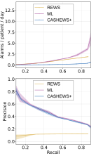
</div>
:::
::: {.column width="70%"}
- **Alarm strategy**^[Work with master student Daniela Zuluaga Lotero]: CASHEWS+ balances sensitivity and alarm burden
<!-- - Regulate alarm frequency with grace period, persistence, and silencing (preventing alarm fatigue). -->

::: {.fragment fragment-index="4"}
<!-- -  2 alarms per day on a 100-bed ward. -->
- Decision curve analysis ^[[@vancalsterReportingInterpretingDecision2018]]: **how much harm  am I willing to accept?**
<!-- <div style="text-align: center; margin-top: -0em;">
  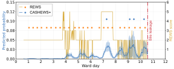
</div> -->
<div style="text-align: center; margin-top: -0em;">
  
</div>
:::
:::

:::


::: {.notes}
- So how can we integrate this model into the clinical routine? We have to look at alarm systems.
- On the left we can see the Alarm burden quantified as alarms per patient per day (y-axis) across all recall levels (x-axis) for REWS-based alerts, raw ML predictions using a static threshold 
- Here we can see that with a significant decrease in alarm burden, the CASHEWS+ strategy maintains the high precision of the raw ML predictions.
-  But which recall do we want? 
- Decision curve analysis including harm-to-benefit ratios  for optimal alarm strategies per recall bin using CASHEWS+. This hinges on how much harm (intervention/diagnostics/probes) am I willing to accept. The top alarm reflecting the threshold probability interval is shown above the dashed red line. 
- This is a way in which clinicians can make informed decisions about the optimal alarm strategy based on their willingness to accept false positives and available resources.
- **Now that we've discussed a specific clinical use case of ML lets see if others can reproduce these results and build on them.**
- Alert persistence, defined as repeated threshold crossings within a sliding time window, was set to three alerts within the preceding 6 h. Following activation, each alarm was automatically silenced for 8 hours, corresponding to one nursing shift13. A grace period of 48 h — defined as the interval during which alerts preceding a complication were considered true positives — was selected based on the observed lead time in the cohort (51 hours; IQR 9.5–103.0).
:::


<!-- ## Performance Analysis

::: {.incremental}

- The best setup combined manufacturer-derived features with raw PPG embeddings, suggesting that physiological deterioration is better captured through dynamic complexity than through simple threshold-based monitoring.
- Important contributors included heart rate variability, temperature entropy, and respiratory rate, which are consistent with early autonomic stress, loss of physiological complexity, and impending decompensation.
- Gradient Boosted Trees outperformed deep learning in this setting.
- Future semi-autonomous surgical ward with continuous telemonitoring and AI-assisted risk prioritization.
:::

::: {.notes}
- The strongest gains came from continuous, high-resolution wearable data, nearly doubling AUPRC versus models without sensor integration.
::: -->

<!-- ## Clinical use, limitations, next steps

::: {.incremental}

- Future semi-autonomous surgical ward with continuous telemonitoring and AI-assisted risk prioritization.
:::

::: {.notes}

::: -->


# Enabling Reproducible Prediction Experiments 🧪 {data-section-title=""}

::: {.fragment}
​⚡ ****^[[@moorEarlyPredictionSepsis2021;@fleurenMachineLearningPrediction2020a]]:​ Comparing approaches across papers is difficult because of:
:::


::: {.columns}
::: {.column width="20%" .fragment .centering}
{fig-align="center"}
<div style="text-align: center;">
Data/Splits
</div>
:::
::: {.column width="20%" .fragment}
{fig-align="center"}
<div style="text-align: center;">
Cohort
</div>
:::
::: {.column width="20%" .fragment}
{fig-align="center"}
<div style="text-align: center;">
Preprocessing
</div>
:::
::: {.column width="20%" .fragment}
{fig-align="center"}
<div style="text-align: center;">
Evaluation
</div>
:::
::: {.column width="20%" .fragment}
{fig-align="center"}
<div style="text-align: center;">
Code/Models^[[@shillanUseMachineLearning2019a]]
</div>
:::
:::


<!-- ::: 
::: {.callout-warning appearance="simple" style="font-size: 1.5em;"}
Individual research results (models, techniques, ideas) do not generalize accross settings, hindering meaningful scientific progress and clinical translation. ^[[@moorEarlyPredictionSepsis2021;@fleurenMachineLearningPrediction2020a]] - *Dataset, cohort definition, and preprocessing choices can have **larger effects on performance** than the choice of model architecture.* 
::: -->
::: {.callout-tip appearance="simple" style="font-size: 1.5em;" .fragment}
Can we create a framework for reliably reproducing scientific results of clinical prediction models across datasets and preprocessing choices?
:::

::: {.notes}
- That leads me to the second contribution, which is about enabling reproducible research in  clinical machine learning.
- The reproducibility crisis in clinical machine learning is a significant barrier to scientific progress and clinical translation.
-  **Datasets** (private datasets or different public datasets) and splits
-  **Cohort definitions** (patient inclusion/exclusion varies)
-  **Preprocessing** (normalization, imputation, features)
-  **Evaluation metrics**
- **Code not published, incomplete, not reusable or adaptable.** 
:::

## Considerations for Reproducible Clinical ML Research

::: columns
::: {.column width="70%"}
::: {.fragment data-fragment-index="1"}
Problems:

- Medical research is **inherently** complex
- One size fits-all always **impossible**
- Hardcoded ≠ **reproducible**
:::
::: {.fragment data-fragment-index="2"}
Goals:

- **Modular** setup maintaining reproducibility
- **Extensibility** across experiment lifecycle
- **Out-of-the-box** support: datasets, tasks, models
:::
::: {.fragment data-fragment-index="3"}
- **ReciPies**^[[@van_de_Water2026]]: Modular ML preprocessing framework 
- **Yet Another ICU Benchmark (YAIB)**^[[@vandewaterAnotherICUBenchmark2024a]]: framework for reproducible ICU prediction experiments across datasets.
:::
:::
::: {.column width="30%"}
::: {.fragment data-fragment-index="3"}
{fig-cap="ReciPies Logo" width=100%}
{fig-cap="YAIB Logo" width=100%}
:::
:::

:::

::: {.notes}
- So what are the considerations that we need to take into account when designing a framework for reproducible clinical machine learning research?
- First, we need to acknowledge that medical research is inherently complex, and that one size fits all solutions are often impossible. This means that we need to design a framework that is modular and extensible, allowing researchers to adapt it to their specific needs while maintaining reproducibility.
- Second, we need to ensure that the framework provides customization and extension and that there is out-of-the-box support for common datasets, tasks, and models.
- To address these considerations, we developed two tools: ReciPies, a modular ML preprocessing framework, that allows you to declare preprocessing steps
- Yet Another ICU Benchmark (YAIB), a framework for reproducible ICU prediction experiments across 5 existing datasets and 5 common tasks.
- Open-access Intensive Care Unit (ICU) data has become popular for applications, models, and benchmarks in ML for health, but comparing approaches often remains difficult
:::

<!-- Modular ML preprocessing framework -->
 <!-- enables reproducible comparisons while remaining flexible enough to accommodate real-world research needs.  -->
<!-- ::: {.incremental}
1. **Data Harmonization** [@Ben23]
2. **Modular Preprocessing** (ReciPies) [@vSR26]
3. **Standardized, explicit, configurable evaluation** [@DGS18]
::: -->

## Different Definitions, Different Conclusions
- Sepsis: Potentially life-threatening **response to infection** that causes injury to its own tissues and organs.

<!-- | **Algorithm** | \multicolumn{2}{c}{Seymour et al.^[[@seymourAssessmentClinicalCriteria2016]]*} | \multicolumn{2}{c}{Moor et al. ^[[@moorPredictingSepsisMultisite2021]]} | \multicolumn{2}{c}{Calvert et al. ^[[@calvertComputationalApproachEarly2016]]} -->


::: {.fragment data-fragment-index="3"}

::: {.columns}
::: {.column width="100%"}
- Prediction on MIMIC-IV^[[@johnsonMIMICIVFreelyAccessible2023]] using Gated Recurrent Unit (GRU) and Light Gradient Boosting Machine (LGBM) models with **different cohort definitions**^[[@seymourAssessmentClinicalCriteria2016; @moorPredictingSepsisMultisite2021; @calvertComputationalApproachEarly2016]]:

<div style="text-align: center;">
{caption="Sepsis Definitions auroc" width=50% .no-dark}
</div>
:::
<!-- ::: {.column width="50%"}
{caption="Sepsis definition auprc" width=100% .no-dark}
::: -->
:::
<!-- | **Algorithm** | Seymour et al.^[[@seymourAssessmentClinicalCriteria2016]]* |         | Moor et al.^[[@moorPredictingSepsisMultisite2021]] |         | Calvert et al.^[[@calvertComputationalApproachEarly2016]] |         |
|---|---|---|---|---|---|---|
|   | **AUROC** | **AUPRC** | **AUROC** | **AUPRC** | **AUROC** | **AUPRC** |
| **LGBM** | 75.9±0.2 | 4.3±0.0 | 72.4±0.0 | 10.5±0.0 | 62.2±0.2 | 1.8±0.0 |
| **GRU** | **79.2±0.1** | **6.1±0.0** | **80.9±0.0** | **17.7±0.0** | **89.2±0.0** | **9.3±0.2** | -->

<!-- - Different sepsis definitions^[[@seymourAssessmentClinicalCriteria2016; @moorPredictingSepsisMultisite2021; @calvertComputationalApproachEarly2016]] can significantly alter the resulting Area Under the Receiver Operating Characteristic Curve (AUROC) and Area Under the Precision-Recall Curve (AUPRC) -->
<!-- - Different definitions capture different patient populations, leading to varying model performance and clinical implications. -->

:::

::: {.notes}
- To demonstrate the need of a common reference point for reproducible research, we can look at the task of sepsis prediction, which is a common task in clinical machine learning.
- Sepsis is a body's extreme response to an infection, which can lead to tissue damage, organ failure, and death. 
- However, there are different definitions of sepsis that have been proposed in the literature, and these definitions can significantly alter the resulting performance metrics of models trained to predict sepsis.
- This then leads to varying model performance and clinical implications.
- For clinicians this means that selecting the right model for their setting is difficult without a common reference point.
- This underlines the need for a framework that can test the effect of different definitions, preprocessing choices, and datasets on model performance in a reproducible way.

:::
---

## YAIB: Mortality Prediction Across Datasets

::: {.column width="50%" }
- Training row dataset, evaluation on column dataset using GRU:
<div style="text-align: center; margin-top: -1em;">
{fig-cap="External Validation - Mortality AUROC" width=85% .no-dark}
</div>
<details>
  <summary></summary>
  <div style="text-align: center; margin-top: -2em;">
    
  </div>
</details>
:::

::: {.column width="50%" .fragment }
- Train a model on "generalizable" eICU and finetune on "difficult" HiRID:
<div style="text-align: center; margin-top: -1em;">
{fig-cap="Transfer Learning - Mortality AUROC" width=76% .no-dark}
</div>
<details>
  <summary></summary>
<div style="text-align: center; margin-top: -2em;">
{fig-cap="Transfer Learning - Mortality AUPRC" width=76% .no-dark}
</div>
</details>

:::
<div data-id="recipies-logo-box" style="position:absolute; right:2%; top:80%; width:12%; text-align:right;">
  
</div>
::: {.notes}
- Using YAIB, we can easily compare generalization across datasets and transfer learning approaches for mortality prediction:
- Some datasets are more similar to others. The European datasets are different from the US datasets. However, eICU, which consists of data from 208 US hospitals is more generalizable than the other datasets, which are from single hospitals.
- Finetuning on the "difficult" HiRID dataset can improve performance with only a fraction of the data, suggesting that pretraining on a large, generalizable dataset can help overcome some of the challenges of dataset shift and improve generalization to new settings.
:::

<!-- ::: {.fragment}

- **Column**: Model trained on dataset
- **Row**: Model evaluated on dataset
- **Diagonal**: Internal validation (same dataset)

::: -->


<!-- ## Transfer Learning

- What if we train a generalized model on "most generalizable" eICU?
- Finetune on "difficult" HiRID

::: {.fragment}

::: {.column width="50%"}
AUROC:
{fig-cap="Transfer Learning - Mortality AUROC" width=100% .no-dark}

:::

::: {.column width="50%"}
AUPRC:
{fig-cap="Transfer Learning - Mortality AUPRC" width=100% .no-dark}

:::
::: -->

<!-- ## Conclusion
- True reproducibility in clinical ML requires more than just code release; it demands modular, flexible, and standardized pipelines that can adapt to the complexities of real-world data and research needs.
- YAIB: 96 GitHub stars; 44 citations; Adaption across community ^[[@shenDataAdditionDilemma2024a,@santosImprovingRepresentationLearning2025,@rockenschaubImpactMultiInstitutionDatasets2024,@fuentesPrivacyPreservingDatasetCombination2025]] -->

# Framework for Foundational Health AI 🏗️ {data-section-title=""}

::: {.incremental}
​⚡ ****:

::: {.fragment}
::: {.card-row .card-row--stack}
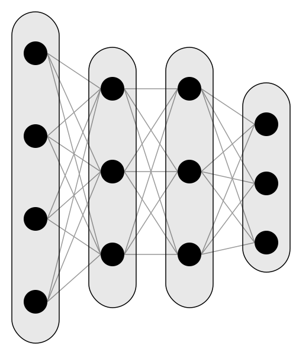{height=3em .light-only}

**Event-based Foundation Models (FMs) are now central to clinical ML research.**^[[@bommasaniOpportunitiesRisksFoundation2021;@steinbergLanguageModelsAre2021]]
:::
:::

::: {.fragment}
::: {.card-row .card-row--stack}
{height=3em .light-only}

**Applying high-parameter AI to health data still lacks robust, standardized infrastructure.** ^[[@mcdermottLackScienceMachine2025; @donohoDataScienceSingularity2024]]
:::
:::

<!-- **Example:** Mount Sinai Health System (MSHS) has 6.8 million patients
- **Before MEDS:** Data in OMOP format; every research project wrote custom extraction code (~3-6 weeks per project)
- **After MEDS:** Standardized ETL pipeline; research ready in days -->
:::

::: {.callout-tip appearance="simple" style="font-size: 1.5em;" .fragment}
How can we enable reproducible AI research across healthcare systems?
:::

::: {.fragment}
<div style="text-align: center; margin-top: -0em; display:flex; align-items:center; justify-content:center; gap:0.6em;">
  
  <span class="meds-label">MEDS: Medical Event Data Standard</span>
</div>
:::

::: {.notes}
- Given that, of course, health data is not always like the structured, clean, and well-labeled open-access ICU datasets.
- With the advent of Large Language Models, we now have high-parameter AI "foundation models", that are trained on large-scale EHR data with the objective to predict the next token.
- Unfortunately, applying these high-parameter AI models to health data still lacks robust, standardized infrastructure, which is a significant barrier to reproducible research and scientific progress in this field.
- Donoho highlights the term of frictionless reproducibility for data science which highlights the growing need for robust infrastructure to support reproducible research across healthcare systems.
- Currently, the ML4H community often reinvents the wheel, and with the increasing complexity of models and data, comparing results across settings becomes increasingly difficult.
- This leads us to the question of how can we enable reproducible AI research across healthcare systems?
- Well, with a new data standard and ecosystem for health AI research, which we call the Medical Event Data Standard (MEDS).

:::
## Data Standards in Healthcare
<div style="text-align: center;">
   
</div>
<div style="text-align: center; margin-top: -1.5em;">
  <a href="https://xkcd.com/927/" target="_blank" style="font-size: 0.5em; text-align: center;">Source: https://xkcd.com/927/</a>
</div>

::: { .incremental}
- OMOP ^[[@hripcsakObservationalHealthData2015]], PCORnet ^[[@collinsPCORnetTurningDream2014]], FHIR^[[@benderHL7FHIRAgile2013]], and i2b2^[[@murphyServingEnterpriseInformatics2010]].
- Have enabled **observational studies** and **health data exchange** ^[[@callahan2021using; @suchardComprehensiveComparativeEffectiveness2019]].
- But they are not designed for **high-parameter AI research**.
:::

::: {.notes}
- I know that researchers are eager to create new data standards and frameworks, that might already exist as evident in this comic. 
- There are existing data standards in healthcare, such as OMOP, PCORnet, FHIR, and i2b2, have been instrumental in enabling observational studies and health data exchange. 
- They are Disease-specific cohorts and specific manual featurization of engineered features 
- But, they are generally not suitable to train over a general-purpose representation of the entire EHR
:::

## The Medical Event Data Standard (MEDS)
::: {.callout-tip title="Characteristics" style="font-size: 1.5em;"}
::: {.incremental}
1. **ML-First** - not observational research
2. **Flexible** - adapts to data source and research needs
3. **Event-Based** - longitudinal healthcare data
4. **Interoperable** - tools composable across settings
:::
:::
::: {.columns}
::: {.column width="50%" .fragment}
<div style="text-align: center;">
  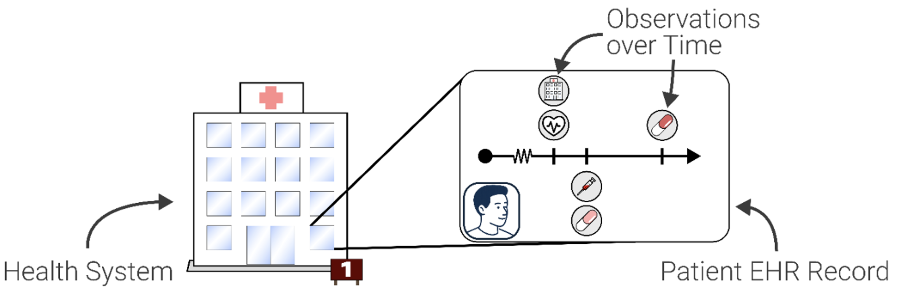
</div>
:::
::: {.column width="50%" .fragment}
<div style="text-align: center;">
  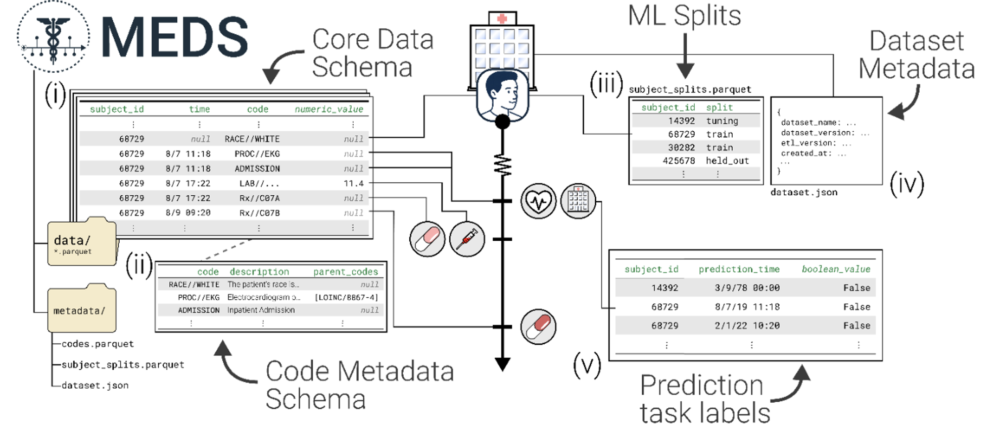
</div>
::: {.tiny-text}
  Adapted from McDermott et al. "MEDS: An Emerging Data Standard and Ecosystem for Health AI Research" Accepted to NEJM AI (2026), to appear in vol:3, iss:6 (2026).
:::
:::
:::

::: {.notes}
We wanted to create a framework that is

1. ML-first: Optimized for ML tasks, not observational research.
2. **Flexible** - Works with OMOP, FHIR, open-access datasets, proprietary (private) health systems, and is quickly adaptable to new data sources.
3. **Event-Based** - Natural representation for longitudinal healthcare data
4. **Interoperable** - Tools compose together across datasets and institutions

- We created the Medical Event Data Standard (MEDS), a flexible, event-based data standard optimized for machine learning research in healthcare.

:::


<!-- ```python
# Core MEDS Schema (v0.4.0)
from pyarrow.schema import Schema as PyArrowSchema
import pyarrow as pa
class DataSchema(PyArrowSchema):
    subject_id: Required(pa.int64(), nullable=False)
    time: Required(pa.timestamp("us"), nullable=True)
    code: Required(pa.string(), nullable=False)
    numeric_value: Optional(pa.float32())
    text_value: Optional(pa.large_string())
``` -->


## MEDS-DEV: Decentralized External Validation
::: {.incremental}
- Reproducible benchmarking is critical for scientific progress
- Sharing raw patient data across institutions is often not possible due to privacy concerns.
:::

::: {.callout-tip appearance="simple" style="font-size: 1.5em;" .fragment}
Define standardized *predicates* for tasks and have drop-in definitions for each dataset^[[@mcdermottMEDSDecentralizedExtensible2024;@xuACESAutomaticCohort2024a]].
:::

::: {.fragment}


::: {.columns}
:::
::: {.column width="50%"}
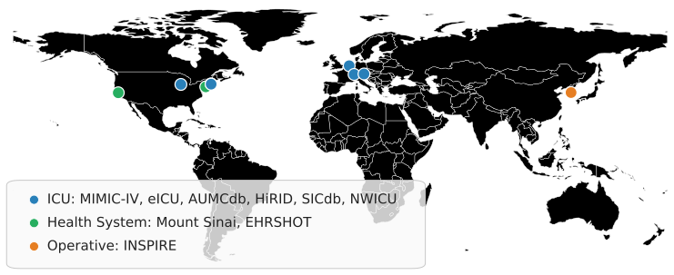{width=100% fig-align="center"}

:::
::: {.column width="25%" .fragment}
{width=50% fig-align="center"}

<div style="text-align: center;">
11 Tasks
</div>
:::
::: {.column width="25%" .fragment}
{width=40% fig-align="center"}

MEDS-Tab, CEHR-BERT, GenHPF^[@oufattoleMEDSTabAutomatedTabularization2024;@pangCEHRBERTIncorporatingTemporal2021; @hurGenHPFGeneralHealthcare2024a]
:::

:::

<!--  -->


::: {.notes}
- We can use MEDS to enable decentralized external validation across datasets and institutions.
- Reproducible benchmarking is critical for scientific progress, but sharing raw patient data across institutions is often not possible due to privacy concerns.
- The solution is to define standardized predicates for tasks and have drop-in definitions for each dataset, which allows for benchmarking across datasets without sharing raw patient data.
- MEDS-DEV is a collective effort that I expanded to 8 other datasets, including health systems open-access datasets
- Each site independently trains and evaluates models using the same standardized definitions, allowing for meaningful comparisons while respecting data privacy. 
- The configurations can be shared across sites, enabling researchers to identify factors that contribute to performance variability.
- 3 Complete Blood Count, 5 blood chemistry, 2 Vital Sign, Mortality, Readmission


:::

---

## Results depend heavily on dataset/task choice

::: {.columns}
::: {.column width="40%"}
<div style="position:relative; width:80%; margin:-1em auto 0; isolation:isolate;">
  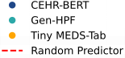

  
  
</div>
:::

::: {.column width="50%"}
::: {.fragment}
<div style="text-align: right;  margin-top: -1em;">
  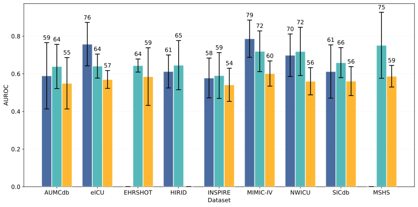
</div>

- Some models incompatible with some datasets/tasks.

:::
::: {.fragment}
- There is no absolute ordering in performance.
- **Easy reproducibility is crucial for research.**
:::
:::
:::

::: {.notes}
- If we then benchmark each task across sites and models, we get an enormous amount of results.
- Each point on the left represents a model trained and evaluated at a specific site, with the same task definition
- The spread of points across sites for the same model and task highlights the variability in performance due to differences in data and implementation, underscoring the need for standardized benchmarking.
- The overall performance trends across models and tasks can be compared, but the variability emphasizes that results from one site may not generalize to others without careful validation.
- This highlights once again the importance of easy reproducibility and standardized benchmarking frameworks to understand what actually drives model performance across different settings.
:::


## Foundation Models for Health Systems
  <div class="fragment fade-out" data-fragment-index="1"
       style="position:absolute; top:27%; left:0%; width:100%; height:100%; background:white; z-index:2;"></div>

  <div class="fragment fade-out" data-fragment-index="2"
      style="position:absolute; top:27%; left:30%; width:100%; height:100%; background:white; z-index:2;"></div>
{fig-cap="" width=100% .no-dark}


::: {.notes}
- So let's look at doing this on a health system level, where we use the entire Mount Sinai Health System dataset of 12 million patients across different medical centers around New York City. 
- This dataset is already in OMOP format, and we use the OMOP ETL I developed to convert it to MEDS. Leaving behind the legacy imported patients that have not correctly been imported into OMOP, we have 6.8 million patients and a total of 3.5 billion events in the dataset.
- The MEDS ecosystem then enables the use of different tools and of foundation model training for this dataset and the open-access datasets and other health systems
- Here, we will be looking at foundation model training and using the frozen embeddings for linear probing as a case study of how the MEDS ecosystem
- This can enable a wide range of applications, such as downstream clinical prediction systems to serve specialties in the health systems.

:::

## Linear Probing
- Train SOTA FMs^[[@pangFoMoHClinicallyMeaningful2025]], CEHR-XGPT^[[@pangCEHRXGPTScalableMultiTask2025]] and MOTOR^[[@steinbergMOTORTimetoEventFoundation2023a]], on entire MSHS dataset (5.5M patients).
- Embed **patient representations** until prediction time.
- Train a **linear classifier** on top of frozen foundation model representations.

::: {.fragment}
Results across sample input sizes:

<div style="text-align: center; margin-top: -0.5em;">
{width="50%" class="no-dark" }
<div style="text-align: center; margin-top: -1.5em;">
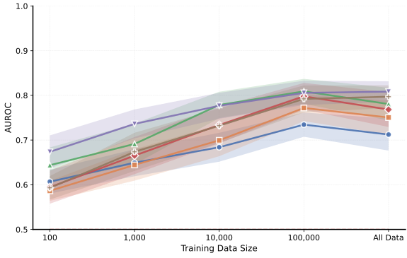{width="50%" class="no-dark"}
</div>
</div>
<!-- <div style="text-align: center; margin-top: -2em;">
  
</div> -->

:::

::: {.notes}
- I trained state-of-the-art foundation models on the entire MSHS dataset, and then we used the frozen embeddings to train a linear classifier on top of the foundation model representations for a range of downstream clinical prediction tasks.
- The performance of the linear classifier on top of the frozen foundation model representations can be compared to traditional machine learning models trained on the same tasks, and this can help us understand the value of the foundation model representations for downstream tasks.
- Cheaper than finetuning, and can be used as a quick benchmark for the quality of the foundation model representations for downstream tasks.
- For lower sample set sizes, we see that the linear classifier on top of the foundation model representations can outperform traditional machine learning models, suggesting that the foundation model representations capture useful information for downstream tasks even with limited data.
- The performance gap decreases as we get more samples as can be expected, but there is still a slight boost compared to the baselines
:::

## Impact of the MEDS Ecosystem

<div style="text-align: center;">
  
</div>
<div class="fragment fade-out" data-fragment-index="1"
      style="position:absolute; top:10%; left:63%; width:100%; height:100%; background:white; z-index:2;"></div>
<div class="fragment fade-out" data-fragment-index="2"
      style="position:absolute; top:48%; left:0%; width:100%; height:100%; background:white; z-index:2;"></div>
::: {.tiny-text}
  Adapted from McDermott et al. "MEDS: An Emerging Data Standard and Ecosystem for Health AI Research" Accepted to NEJM AI (2026), to appear in vol:3, iss:6 (2026).
:::
<!-- - Supported the development of SOTA models for EHR data ^[[@pangCEHRXGPTScalableMultiTask2025;@fallahpourEHRMambaGeneralizableScalable2024a; @rencFoundationModelElectronic2025]]. -->
<!-- - 21 institutions
- $>$ 27 academic papers and preprints
- 17 datasets
- 12 AI algorithms
- Reduction of lines of code up to 70% -->

<!-- ## My Thesis

We require: -->

<!-- ::: {.incremental}
1. **Transparent benchmarking frameworks 🧪**: to understand what actually drives model performance
2. **Prospective clinical studies 🛏️**: to improve quality and validate assumptions from retrospective research
3. **Standardized infrastructure 🏗️**: to enable collaborative, reproducible research at scale
:::  -->

::: {.notes}
- So what is the impact of the MEDS ecosystem?
- It is used in at least 21 institutions, has supported the development of state-of-the-art models for EHR data, and has been used in over 27 academic papers and preprints across 17 datasets and 12 AI algorithms.
- It has also enabled a reduction of lines of code up to 70% for some projects
- I co-designed the schema and ecosystem and created 3 tools and 4 ETLs.


:::

# Overall Discussion and Impact {auto-animate=true}

::: {.columns .discussion-pillars}


::: {.column width="33%"}
::: {.fragment .pub-box .pub-box--pillar1}
****

- Continuous wearable data **nearly doubles AUPRC**
- **Predictive surveillance** can be used beyond ICU into the ward
- Alarm strategies key to **clinical utility**
:::
:::

::: {.column width="33%"}
::: {.fragment .pub-box .pub-box--pillar2}
****

- Experimental setup often matters **more than model choice**
- Multi-center framework for reproducible ML4H benchmarking (44 citations, 96 GitHub stars)
:::
:::

::: {.column width="33%"}
::: {.fragment .pub-box .pub-box--pillar3}
****

<!-- - MEDS-DEV: easily benchmark tasks across different sites and tasks. -->
- MEDS enables reproducible AI research across health systems with wide adoption
- Created 4 Dataset, OMOP, FHIR ETLs and 2 tools
- Benchmarked 9 datasets across 11 tasks
:::
:::
:::
<!-- ::: {.fragment}
**Healthcare ML requires prospective data collection, experimental infrastructure, and institutional commitment to reproducibility.
**::: -->
::: {.fragment .fade-in}

:::

::: {.notes}
- Let's summarize the key takeaways from this thesis:
- For the first pillar, we found that continuous wearable data can nearly double the AUPRC for surgical site infection prediction, and that predictive surveillance can be used beyond the ICU into the ward. We also found that alarm strategies are key to clinical utility.
- For the second pillar, we found that the experimental setup often matters more than the choice of model, and we developed a multi-center framework for reproducible ML4H benchmarking that has been widely adopted in the community.
- For the third pillar, we developed the MEDS ecosystem, which enables reproducible AI research across health systems, and I, personally, created 4 dataset, OMOP, and FHIR ETLs and 3 tools, and benchmarked 9 datasets across 11 tasks.
- Overall, our findings suggest that healthcare ML requires prospective data collection, experimental infrastructure, and institutional commitment to reproducibility to drive meaningful scientific progress and clinical translation.
:::


# Limitations

::: {.fragment fragment-index=1}
::: {.card-row}
{height=3em .light-only}

**Models may amplify existing racial, gender, and socioeconomic biases.**^[[@borgesdonascimentoBarriersFacilitatorsUtilizing2023]]
:::
:::

::: {.fragment fragment-index=2}
::: {.card-row .card-row--stack}
{height=3em .light-only}

**Need validation strategies and randomized trials before deployment.**^[[@wongExternalValidationWidely2021a]]
:::
:::

::: {.fragment fragment-index=3}
::: {.card-row .card-row--stack}
{height=3em .light-only}

**Potential for harmful use (e.g., insurance discrimination, surveillance).**^[[@gaffneyHealthCareUSA2025; @jangOopsInterdisciplinaryStories2025]]
:::
:::

::: {.fragment fragment-index=4}
::: {.card-row .card-row--stack}
{height=3em .light-only}

**(Large) AI models have sizeable environmental impact.**^[[@hosseiniSocialenvironmentalImpactPerspective2025]]
:::
:::
::: {.notes}
- Models may amplify existing (historical) racial, gender, and socioeconomic biases if not carefully validated because they are trained on historical data that reflects these biases.
- Validation strategies and randomized controlled trials are needed to demonstrate clinical utility and safety before deployment. We might not be able to take shortcuts here, even though rcts are expensive and time-consuming, because of the potential for harm if models are deployed without proper validation.
- Can be used for harmful purposes (e.g., insurance discrimination, surveillance, etc.). There are already examples of this happening, and this is why legislation should push for transparency and accountability in the development and deployment of AI models in healthcare.
- (Large) AI models can have sizeable environmental impact. We see this in the training of large language models, and this is something that we need to be mindful of as we develop and deploy AI models in healthcare. We should strive to develop simpler models where possible as this can even lead to an improved physiological understanding as we saw in the first contribution. 
:::


# Future Research Directions

::: {.fragment }
::: {.card-row .card-row--stack}
{height=3em .light-only}

**Advances in Multi-Modal Health Foundation Models**
:::
:::
::: {.fragment }
::: {.card-row .card-row--stack}
{height=3em .light-only} 

**Generalizability versus Specificity**^[[@burkhartFoundationModelsElectronic2025a;@futomaMythGeneralisabilityClinical2020a; @vancalsterThereNoSuch2023]]

:::
:::

::: {.fragment }
::: {.card-row .card-row--stack}
{height=3em .light-only}

**Scaling up: datasets, model size, benchmarking**^[[@waxlerGenerativeMedicalEvent2025; @zhangExploringScalingLaws2025; @huangOverTokenizedTransformerVocabulary2025]]
:::
:::

::: {.fragment }
::: {.card-row .card-row--stack}
{height=3em .light-only}

**Predictive surveillance and transferable patient representations.**^[[@kernCareFragmentationCare2024]] 
:::
:::

::: {.notes}
- Multi-modal: Clinical Notes, Pathology, Radiology, Genomics, Wearables, etc. I am currently working on expanding my FMs to pathology as this is widely available in MSHS.
- Generalizability versus Specificity: Different health systems have different data generating processes and different patient populations. Should we optimize for generalizability or for performance on specific settings?
- Scaling up: how does performance improve with more data, compute, and model size? Understanding scaling laws in health AI can inform the development of more efficient and effective models.
- Predictive surveillance: scheduling mammograms in advance if a patient is at high risk of developing breast cancer.
- Transferable patient representations: Developing models that can effectively transfer knowledge across different healthcare providers (GP and specialists), reducing fragmentation.

:::

<!--
## United Nations WHO Digital Health Objectives

::: {.centered}
{fig-cap="World Health Organization" height=5em .no-dark}
:::

::: {.bigger-text}

::: {.fragment .fade-in fragment-index=1}

::: {.fragment .highlight-green fragment-index=5}
   - Promote global collaboration & advance the transfer of knowledge on digital health
:::
::: 
::: {.fragment .fade-in fragment-index=2}
   - Advance the implementation of national digital health strategies
:::
::: {.fragment .fade-in fragment-index=3}
   - Strengthen governance for digital health at global, regional and national levels
:::
::: {.fragment .fade-in fragment-index=4}
   - Advocate people-centered health systems that are enabled by digital health
:::

:::
::: {.notes}
In my thesis we focus on 1 in particularly while respecting and complementing the other objectives; of which the latter 3 and 4 are most important.
- https://www.itu.int/en/ITU-T/Workshops-and-Seminars/2024/0509/Documents/Carl%20LEITNER.pdf 
::: -->

# Acknowledgements {data-background-image="figures/backgrounds/cover_image_thesis_wide.png" data-background-size="cover" data-background-position="center" data-background-opacity="0.15"}
All friends, colleagues, mentors, collaborators, reviewers, and family who supported me.

::: {.small-text}
::: {.columns}
::: {.column width="25%"}
HPI:

- Christoph Lippert
- Lothar Wieler
- Felix Naumann
- Gerard de Melo
- Bert Arnrich
- Hendrik Schmidt
- Edit Tatar, Cornelia Philippson, Katharina Lorenz-Shroeder, Lena Kaese
:::
::: {.column width="25%"}
Charité:

- Max M. Maurer
- Axel Winter
- Daniela Zuluaga Lotero
:::
::: {.column width="25%"}
Mentors and Collaborators:

- Patrick Rockenschaub (Medical University of Vienna)
- Matthew McDermott (Columbia University)
- Eugenia Alleva (Mount Sinai)
- Jason Fries (Stanford)
:::
::: {.column width="25%"}
Reviewers:

- Padhraic Smyth (UC Irvine)
- Mykola Pechenizkiy (TU Eindhoven)
:::
:::
:::

::: {.columns}
<div style="text-align: center; margin-top: -1.5em;">
</div>
::: {.column width="33%"}

:::

::: {.column width="33%"}
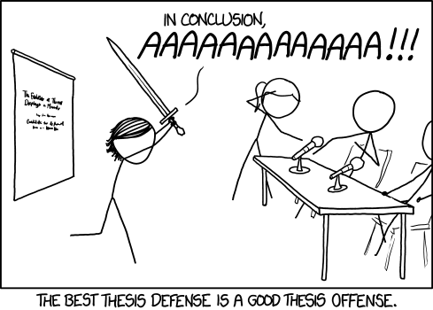{width=100% .no-dark .center}
<div style="text-align: center; margin-top: -1.5em;">
  <a href="https://xkcd.com/1403/" target="_blank" style="font-size: 0.5em; text-align: center;">Source: https://xkcd.com/1403/</a>
</div>
<div style="text-align: center; margin-top: -1em;">
{width=50% .no-dark}
</div>
:::

::: {.column width="33%"}
<div style="text-align: center; margin-top: -1.5em;">
{width=80% .no-dark .center}
</div>
<div style="text-align: center; margin-top: -1.0em;">

<a href="https://www.rpvandewater.com/assets/documents/van_de_Water_dissertation_thesis_22_jan.pdf" target="_blank">
Read the thesis</a>
</div>
:::
:::

<!-- The field of machine learning for healthcare stands at an inflection point. We have:
- ✓ Demonstrated predictive capability (models work in controlled settings)
- ✓ Shown deployment is feasible (CASSANDRA, clinical partnerships)
- ✓ Built reusable infrastructure (MEDS ecosystem)

**What Remains:**
- Translating research into routine clinical practice (workflow integration)
- Ensuring equitable deployment across diverse healthcare systems
- Maintaining humility about what ML can and cannot do in healthcare --> 


<!-- ## Thank You -->

<!-- *Key Takeaways:*
1. Reproducibility framework (YAIB) reveals that experimental setup often matters more than model choice
2. Prospective validation (CASSANDRA) shows what works in reality, not just in retrospective analysis
3. Standardized data format (MEDS) enables community collaboration and faster scientific progress -->

<!-- *Broader Vision:*
Healthcare ML can improve outcomes when built on solid infrastructure, rigorous validation, and commitment to reproducibility. -->


## References {data-background-image="figures/backgrounds/cover_image_thesis_wide.png" data-background-size="cover" data-background-position="center" data-background-opacity="0.15"}

::: {#refs}
:::
<script>

</script>
<script>

</script>
<!-- <script>
(function () {
  const FADE_MS = 500;

  function getFootnoteAside(slide) {
    if (!slide) return null;
    const asides = slide.querySelectorAll(':scope > aside');
    for (const aside of asides) {
      if (aside.querySelector(':scope > ol.aside-footnotes')) return aside;
    }
    return null;
  }

  function getVisibleFootnoteNumbers(slide) {
    const nums = new Set();
    const sups = slide.querySelectorAll('sup');

    sups.forEach((sup) => {
      const frag = sup.closest('.fragment');
      const fragmentVisible =
        !frag ||
        frag.classList.contains('visible') ||
        frag.classList.contains('current-fragment');

      if (!fragmentVisible) return;

      const n = Number.parseInt((sup.textContent || '').trim(), 10);
      if (Number.isFinite(n)) nums.add(n);
    });

    return nums;
  }

  function ensureFadeInit(el) {
    if (!el || el.dataset.fnInit === '1') return;
    el.dataset.fnInit = '1';
    el.style.transition = 'opacity ' + FADE_MS + 'ms ease';
    el.style.opacity = '0';
    el.style.display = 'none';
  }

  function setFadeState(el, show) {
    if (!el) return;
    ensureFadeInit(el);

    const wasShown = el.dataset.fnShown === '1';
    if (show === wasShown) return;
    el.dataset.fnShown = show ? '1' : '0';

    if (show) {
      el.style.display = '';
      el.style.opacity = '0';
      requestAnimationFrame(() => {
        if (el.dataset.fnShown === '1') {
          el.style.opacity = '1';
        }
      });
    } else {
      el.style.opacity = '0';
      window.setTimeout(() => {
        if (el.dataset.fnShown !== '1') {
          el.style.display = 'none';
        }
      }, FADE_MS);
    }
  }

  function syncSlideFootnotes(slide) {
    const footAside = getFootnoteAside(slide);
    if (!footAside) return;

    const list = footAside.querySelector(':scope > ol.aside-footnotes');
    if (!list) return;

    const visibleNums = getVisibleFootnoteNumbers(slide);
    let anyShown = false;

    Array.from(list.children).forEach((li, idx) => {
      const liNum = idx + 1;
      const show = visibleNums.has(liNum);

      setFadeState(li, show);
      if (show) anyShown = true;
    });

    setFadeState(footAside, anyShown);
  }

  function refresh(evt) {
    const slide =
      (evt && evt.currentSlide) ||
      (window.Reveal && Reveal.getCurrentSlide && Reveal.getCurrentSlide());

    if (slide) syncSlideFootnotes(slide);
  }

  function init() {
    if (!window.Reveal) return;
    Reveal.on('ready', refresh);
    Reveal.on('slidechanged', refresh);
    Reveal.on('fragmentshown', refresh);
    Reveal.on('fragmenthidden', refresh);
    refresh();
  }

  if (document.readyState === 'loading') {
    document.addEventListener('DOMContentLoaded', init);
  } else {
    init();
  }
})();
</script> -->
<!--  -->
