## How do solve this in practice?

::: columns
::: {.column width="70%"}
::: {.fragment data-fragment-index="1"}
Problems:

- Medical research is **inherently** complex
- One size fits-all always **impossible**
- Hardcoded ≠ **reproducible**
:::
::: {.fragment data-fragment-index="2"}
Goals:

- **Modular** setup maintaining reproducibility
- **Extensibility** across experiment lifecycle
- **Out-of-the-box** support: datasets, tasks, models
:::
::: {.fragment data-fragment-index="3"}
- **ReciPies**^[[@van_de_Water2026]]: Modular ML preprocessing framework 
- **Yet Another ICU Benchmark (YAIB)**^[[@vandewaterAnotherICUBenchmark2024a]]: framework for reproducible ICU prediction experiments across datasets.
:::
:::
::: {.column width="30%"}
::: {.fragment data-fragment-index="3"}
{fig-cap="ReciPies Logo" width=100%}
{fig-cap="YAIB Logo" width=100%}
:::
:::

:::

<!-- Modular ML preprocessing framework -->
 <!-- enables reproducible comparisons while remaining flexible enough to accommodate real-world research needs.  -->
<!-- ::: {.incremental}
1. **Data Harmonization** [@Ben23]
2. **Modular Preprocessing** (ReciPies) [@vSR26]
3. **Standardized, explicit, configurable evaluation** [@DGS18]
::: -->

---

## The YAIB Experimental Pipeline


<div style="text-align: center; position: relative; top: 10%">
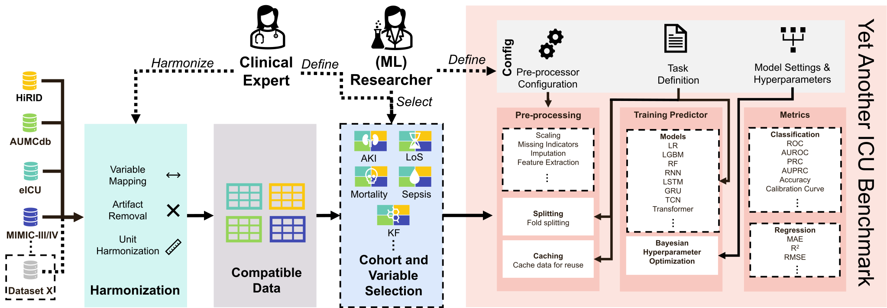{fig-cap="YAIB Experimental Pipeline" width=110%}
</div>

---

## ReciPies: A Simple Modular Preprocessing Framework for ML Research
{fig-cap="ReciPies Flow" width=100% .no-dark}

<div style="position: absolute; bottom: 0; right: 0; text-align: right;">
{fig-cap="My caption" width=10% .no-dark}
</div>
---
 
## Datasets and Tasks

Four publicly available ICU datasets:

<!-- - MIMIC-IV^[[@johnsonMIMICIVFreelyAccessible2023]]
- eICU^[[@pollardEICUCollaborativeResearch2018]]
- HiRID^[[@hylandEarlyPredictionCirculatory2020]]
- AUMCdb^[[@thoralSharingICUPatient2021]] -->
| **Dataset**                  | **MIMIC-III / IV** | **eICU** | **HiRID** | **AUMCdb** |
|------------------------------|--------------------|----------|-----------|------------|
| **Stays**                  | 40k (0.1k) / 73k | 201k (2k) | 34k       | 23k        |
| **Version**                 | v1.4 / v2.2        | v2.0     | v1.1.1    | v1.0.2     |
| **Frequency (time-series)** | 1 hour             | 5 minutes| 2 / 5 minutes | up to 1 minute |
| **Origin**                  | USA                | USA      | Switzerland | Netherlands |
| **Originally published**    | 2015^[[@johnsonMIMICIIIFreelyAccessible2016]] / 2020^[[@johnsonMIMICIVFreelyAccessible2023]] | 2017^[[@pollardEICUCollaborativeResearch2018]] | 2020^[[@hylandEarlyPredictionCirculatory2020]] | 2019^[[@thoralSharingICUPatient2021]] |

**Five common ICU prediction tasks**: Mortality, Acute Kidney Injury, Sepsis, Kidney Function, Length of Stay.

---

## Sepsis: Different Definitions, Different Conclusions
- Potentially life-threatening response to infection that causes injury to its own tissues and organs
- Sepsis prediction on MIMIC-IV using Gated Reccurrent Unit (GRU) and Light Gradient Boosting Machine (LGBM) models:

::: {.incremental}
<!-- | **Algorithm** | \multicolumn{2}{c}{Seymour et al.^[[@seymourAssessmentClinicalCriteria2016]]*} | \multicolumn{2}{c}{Moor et al. ^[[@moorPredictingSepsisMultisite2021]]} | \multicolumn{2}{c}{Calvert et al. ^[[@calvertComputationalApproachEarly2016]]} -->


::: {.fragment data-fragment-index="3"}
::: {.columns}
::: {.column width="50%"}
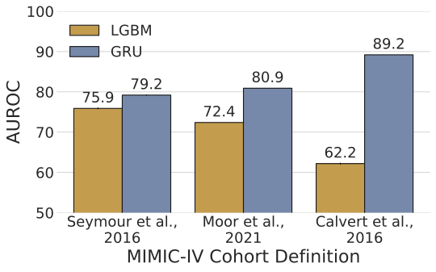{caption="Sepsis Definitions auroc" width=100% .no-dark}
:::
::: {.column width="50%"}
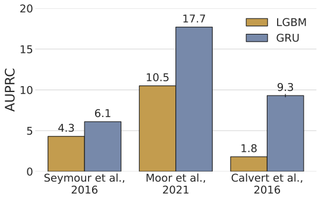{caption="Sepsis definition auprc" width=100% .no-dark}
:::
:::
:::
<!-- | **Algorithm** | Seymour et al.^[[@seymourAssessmentClinicalCriteria2016]]* |         | Moor et al.^[[@moorPredictingSepsisMultisite2021]] |         | Calvert et al.^[[@calvertComputationalApproachEarly2016]] |         |
|---|---|---|---|---|---|---|
|   | **AUROC** | **AUPRC** | **AUROC** | **AUPRC** | **AUROC** | **AUPRC** |
| **LGBM** | 75.9±0.2 | 4.3±0.0 | 72.4±0.0 | 10.5±0.0 | 62.2±0.2 | 1.8±0.0 |
| **GRU** | **79.2±0.1** | **6.1±0.0** | **80.9±0.0** | **17.7±0.0** | **89.2±0.0** | **9.3±0.2** | -->

- Different sepsis definitions^[[@seymourAssessmentClinicalCriteria2016; @moorPredictingSepsisMultisite2021; @calvertComputationalApproachEarly2016]] can significantly alter the resulting Area Under the Receiver Operating Characteristic Curve (AUROC) and Area Under the Precision-Recall Curve (AUPRC)
<!-- - Different definitions capture different patient populations, leading to varying model performance and clinical implications. -->

:::

::: {.notes}
Different definitions capture different patient populations, leading to varying model performance and clinical implications.
**Note:** Our definition (marked with *), adapted to be more clinically actionable. See Appendix for details.
:::
---

## External Validation with Mortality

::: {.column width="50%"}
AUROC:
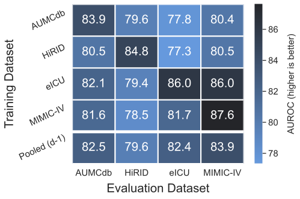{fig-cap="ReciPies Flow" width=100% .no-dark}

:::

::: {.column width="50%"}
AUPRC:
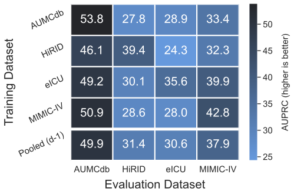{fig-cap="ReciPies Flow" width=100% .no-dark}

:::

::: {.fragment}

- **Column**: Model trained on dataset
- **Row**: Model evaluated on dataset
- **Diagonal**: Internal validation (same dataset)

:::

---

## Transfer Learning

- What if we train a generalized model on "most generalizable" eICU?
- Finetune on "difficult" HiRID

::: {.fragment}

::: {.column width="50%"}
AUROC:
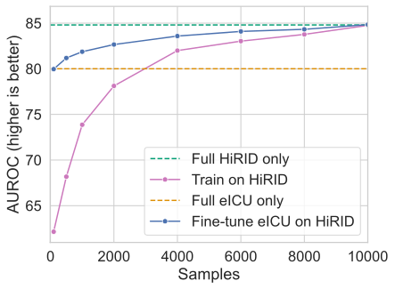{fig-cap="" width=100% .no-dark}

:::

::: {.column width="50%"}
AUPRC:
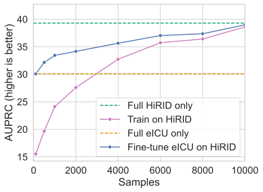{fig-cap="" width=100% .no-dark}

:::
:::
<!-- ## Continuous AI-Assisted Wearable Monitoring for Early Detection of Postoperative Complications: A Prospective Cohort Study -->
# Multi-ward Multi-modal Early Warning Systems 🛏️
​⚡​ Retrospective data does not reflect the information needed for clinical decision-making.

::: {.incremental}
- More than 300 million surgical procedures performed annually worldwide^[[@dobsonTraumaMajorSurgery2020]]
- 1/3 of hospital costs are surgery-related^[[@shrimeGlobalBurdenSurgical2015]]
- **Postoperative adverse events** impact consequent quality of life, healthcare costs, and mortality^[[@brownImpactPostoperativeComplications2014; @downeyImpactInhospitalPostoperative2023; @kongASOVisualAbstract2021; @muallaImpactPostoperativeComplications2021; @sartelliComplicatedIntraabdominalInfections2014; @vonlanthenImpactComplicationsCosts2011; @wangPostoperativeComplicationsPrognosis2019]]
- Physiological patterns are often subtle, nonspecific, and time-varying, with substantial heterogeneity between patients^[[@roppeltArtificialIntelligenceHealthcare2024]] → hard to detect on sparsely monitored general ward, where most postoperative patients rehabilitate.
- Why not just monitor patients in the ICU? → expensive and can lead to complications like infections, delirium, and deconditioning.
- Solution? **Hybrid ward with minimally intrusive wearables**
:::
::: {.notes}
- Surgical patients are stabilized on the ICU, and then transferred to the general ward, where they are monitored less frequently.
- Postoperative complications are common and often go undetected until they become severe, leading to worse outcomes and higher costs.
:::

<!-- ## Surgery Rehabilitation
::: {.incremental}
- More than 300 million surgical procedures performed annually worldwide^[[@dobsonTraumaMajorSurgery2020]]
- 1/3 of hospital costs are surgery-related^[[@shrimeGlobalBurdenSurgical2015]]
- Postoperative adverse events impact consequent quality of life, healthcare costs, and mortality^[[@brownImpactPostoperativeComplications2014; @downeyImpactInhospitalPostoperative2023; @kongASOVisualAbstract2021; @muallaImpactPostoperativeComplications2021; @sartelliComplicatedIntraabdominalInfections2014; @vonlanthenImpactComplicationsCosts2011; @wangPostoperativeComplicationsPrognosis2019]]
- Why not just monitor patients in the ICU?
  - ICU stays are expensive and can lead to complications like infections, delirium, and deconditioning.
- Solution? Hybrid ward with minimally intrusive wearables
::: -->

<!-- 
## Why not just monitor patients in the ICU?

::: {.incremental}
- ICU AI model research is booming^[[@hylandEarlyPredictionCirculatory2020a; @nematiInterpretableMachineLearning2018]], but:
  - ICU costs are high, recovery slow(er)
- Nursing ward is less resource constrained, but:
  - Severely less monitored
- Solution? Hybrid ward with minimally intrusive wearables
:::

::: {.notes}
- So why not just monitor patients in the ICU?
- ICU stays are expensive and can lead to complications like infections, delirium, and deconditioning.
:::

--- -->

## A Prospective Cohort Study: "Hybrid Ward"

::: {.column width="80%"}
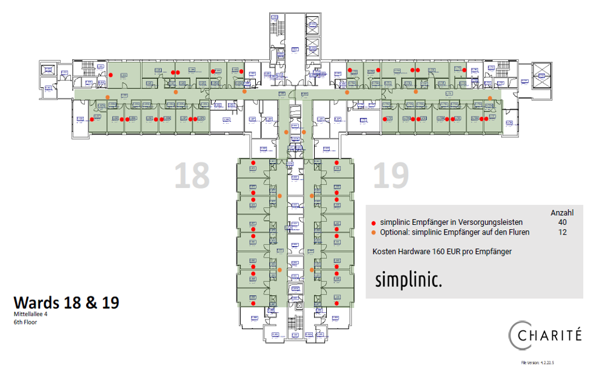{fig-cap="" width=100% .no-dark}
:::

::: {.column width="20%"}
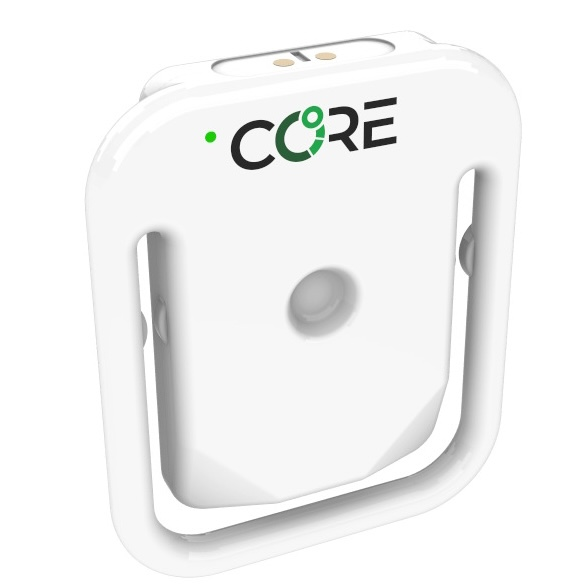{fig-cap="" width=100% .no-dark}
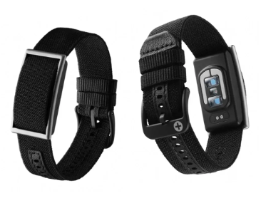{fig-cap="" width=100% .no-dark}
:::
<div style="position:absolute; top:50%; left:45%; width:30%; height:35%; background:white; z-index:2;"></div>
---

<!-- ## Introducing Clinical ASsist Heuristic Early Warning System (CASHEWS) -->
<div style="text-align: center; margin-top: -2em;">
  
</div>


<!-- 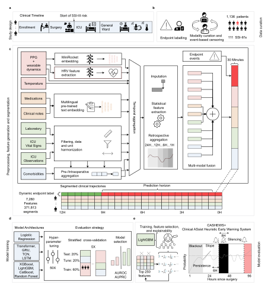{fig-cap="" width=100% .no-dark}

{fig-cap="" width=100% .no-dark} -->

::: {.notes}
Fig. 1: Data segmentation, aggregation, model training, and alarm framework.
a, Timeline of the perioperative patient journey in surgical patients. b, Prospective data curation by endpoint labeling and data extraction from hospital data information systems. c, Schematic overview of data extraction, domain-specific preprocessing, and temporal aggregation. Structured clinical data comprising static, categorical, and binary variables (e.g., demographic data, comorbidities, preoperative laboratory values) and dynamic time-varying measurements (e.g., repeated laboratory examinations, intensive care unit (ICU) vital signs) were processed using domain-specific preprocessing pipelines. Unstructured clinical text data, including clinical notes, medication orders, and fluid administration records, were embedded using a pre-trained multilingual JinAI model²⁷, from which standard natural language processing (NLP) features were derived. High-resolution physiological signals derived from patient wearables on the general ward, specifically photoplethysmography (PPG) and continuous body temperature measurement, were processed using the MINIROCKET embedding model. Heart rate variability (HRV) features were extracted from both time- and frequency-domain representations. Missing values were imputed, and statistical descriptors—including skewness, entropy, standard deviation, minimum, and maximum—were computed. To capture temporal dependencies, features from preceding time steps were incorporated. All data streams were aggregated into 30-minute time segments, each containing 7,280 distinct model features. Multi-modal feature fusion and endpoint alignment resulted in segmented clinical trajectories evaluated at a 9-hour prediction horizon. d, Multiple model architectures, encompassing classical machine learning (ML) and Deep Learning (DL), were trained and evaluated using cross-validation and hyperparameter optimization. Model selection was based on predictive performance and computational efficiency, with LightGBM identified as the most favorable trade-off. e, The optimal model was evaluated by performing domain ablation and feature importance analysis with Shapley explanations. f, Based upon continuous model outputs, an actional alarm system including specific alarming frameworks was evaluated. The slope coefficient and persistence quantify the increase in the probability of sounding an alarm. An 8-hour silencing period is implemented to prevent alarm fatigue.
:::

---

## Clinical ASsist Heuristic Early Warning System (CASHEWS)
- The strongest gains came from continuous, high-resolution wearable data
<div style="text-align: center; margin-top: -0em;">
  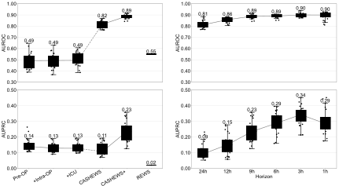
</div>
<div style="position:absolute; top:83%; left:0%; width:100%; height:60%; background:white; z-index:2;"></div>
::: {.notes}
(a) Boxplots of areas under the receiver operating characteristic curve (AUROC) and (b) boxplots of patient-level areas under the precision–recall curve (AUPRC) for progressively enriched models along the perioperative patient trajectory for the target event. Each model extends the previous stage by adding a new data modality, progressing from static preoperative data only (pre-op) to intraoperative (+intra) and intensive care unit (+ICU) data incorporation. Continuous general ward (GW) data are subsequently integrated into dynamic Clinical ASsist Heuristic Early Warning System (CASHEWS) models, including routine clinical data, and finally into CASHEWS+, which contains additional wearable-derived continuous vital sign signal analysis features. The prediction performance of the remote early warning score (REWS) is illustrated for comparison. The online prediction systems are calculated with snoozed episode-level precision-recall28. (c) Boxplots of AUROC and (d) boxplots of AUPRC of CASHEWS+ for varying lead times prior to clinical detection. The last hour was set to be positive, while all subsequent time windows were removed from training and evaluation. (e) AUROC and (f) AUPRC boxplots of model experiment variations, using both GW and ICU segments, using GW time segments for testing (GW only), and using ICU segments for testing (ICU only).
- Static models using only preoperative and ICU data performed near chance, while longitudinal models with wearable telemetry identified deep surgical site infections and postoperative fistulas much earlier.
- Performance was strong, with AUROC up to \(0.89\), and remained robust at clinically relevant lead times: \(0.86\) at 12 hours and \(0.81\) at 24 hours.
- The key implication is that predictive surveillance can be extended beyond the ICU into general wards, where many actionable postoperative complications actually emerge.
:::
<!-- 
---


<div style="text-align: center; margin-top: -2em;">
  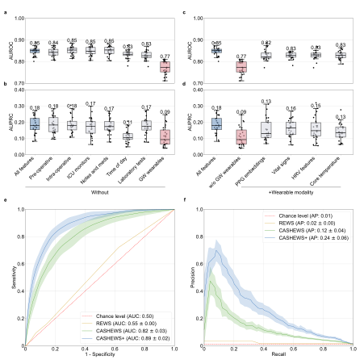
</div>

::: {.notes}
(a) Boxplots of areas under the receiver operating characteristic curve (AUROC) and (b) boxplots of patient-level areas under the precision–recall curve (AUPRC) for prediction performance of models after ablation of individual modalities. (c) AUROC and (d) AUPRC boxplots after addition of wearable-derived signal features (e) Receiver operating curve and (f) precision-recall curves comparing CASHEWS, CASHEWS+, and the remote early warning score (REWS). 
:::
-->
--- 

<!-- <div style="position:absolute; top:0%; left:0%; width:100%; height:60%; background:white; z-index:0;"></div> -->

## Alarm Strategy and Decision Curve Analysis
- Alarms must balance early detection against alert burden. The optimized strategy outperformed the routine early warning score and achieved a practical workload of about 2 alarms per day on a 100-bed ward.
- Decision curve analysis suggested the best operating point at about \(43\%\) event recall with a harm-to-benefit ratio near \(1:4\), indicating clinically meaningful surveillance without excessive alarm fatigue.
<div style="text-align: center; margin-top: -0em;">
  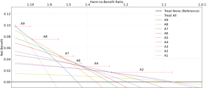
</div>

::: {.notes}
(a) ML predictions of complication and non-complication groups. (b) Comparison of REWS- and CASHEWS+ based alarm predictions using a single-patient example after extended left hemihepatectomy for Klatskin tumor with biliodigestive anastomotic insufficiency at postoperative day 10. Alarms are visualized by individual points and color-coded for both strategies. For CASHEWS+, we used the optimal alarm based on Decision Curve Analysis (A4; see Fig. 5e); for REWS, the alarm strategy in the same recall bin was applied. c, Alarm burden quantified as alarms per patient per day (y-axis) across all recall levels (x-axis) for REWS-based alerts, raw ML predictions using a static threshold, and the final alarm strategy with blackout periods and a dynamic threshold. d, Precision–recall curves comparing REWS, the raw machine learning model, and the dynamic alarm strategy for the prediction e, Decision curve analysis including harm-to-benefit ratios for optimal alarm strategies per recall bin using CASHEWS+. The top alarm reflecting the threshold probability interval is shown above the dashed red line.
:::


## Performance Analysis

::: {.incremental}

- The best setup combined manufacturer-derived features with raw PPG embeddings, suggesting that physiological deterioration is better captured through dynamic complexity than through simple threshold-based monitoring.
- Important contributors included heart rate variability, temperature entropy, and respiratory rate, which are consistent with early autonomic stress, loss of physiological complexity, and impending decompensation.
- Gradient Boosted Trees outperformed deep learning in this setting.
- Future semi-autonomous surgical ward with continuous telemonitoring and AI-assisted risk prioritization.
:::

::: {.notes}
- The strongest gains came from continuous, high-resolution wearable data, nearly doubling AUPRC versus models without sensor integration.
:::

<!-- ## Clinical use, limitations, next steps

::: {.incremental}

- Future semi-autonomous surgical ward with continuous telemonitoring and AI-assisted risk prioritization.
:::

::: {.notes}

::: -->


# Packages and pipelines for Foundational Health AI Research 🏗️

::: {.incremental}
​⚡ Lack of robust infrastructure: the ML4H community reinvents the wheel continuously:

- Different data extraction code for each hospital system
- Incompatible feature engineering approaches
- Non-standard task definitions
- Applying high-parameter artificial intelligence (AI) models to EHR data (health AI) lacks widely adopted data standards.

<!-- **Example:** Mount Sinai Health System (MSHS) has 6.8 million patients
- **Before MEDS:** Data in OMOP format; every research project wrote custom extraction code (~3-6 weeks per project)
- **After MEDS:** Standardized ETL pipeline; research ready in days -->

**Open Question:** *How can we enable reproducible ML research across healthcare systems without requiring every institution to engineer their own ecosystem or harmonize their data and lose granularlity?*
:::

## Data Standards in Healthcare

::: {.columns}
::: { .incremental .column width="60%"}
In observational health informatics:

- OMOP Common Data Model (CDM) ^[[@hripcsakObservationalHealthData2015]], PCORnet ^[[@collinsPCORnetTurningDream2014]], and i2b2 CDM ^[[@murphyServingEnterpriseInformatics2010]]
- Have enabled observational studies in diverse settings ^[[@callahan2021using; @suchardComprehensiveComparativeEffectiveness2019]]
- But they are not designed for **high-parameter AI research**:
  - Primary purpose is observational research 
  - Disease-specific cohorts and specific manual featurization of engineered features 
  - Unsuitable to train over a general-purpose representation of the entire EHR

:::
::: {.column width="40%"}

::: {.fragment}
<div style="text-align: center; position: absolute; top: 20%;">
  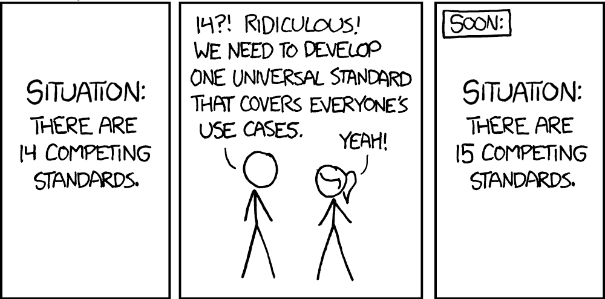
Source: https://xkcd.com/927/
</div>

:::
:::
:::

## The Medical Event Data Standard (MEDS)

<div style="text-align: center;">
  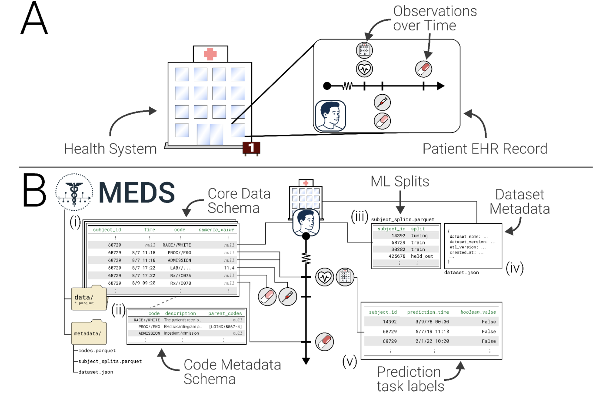
</div>
::: {.tiny-text}
  Adapted from McDermott et al. "MEDS: An Emerging Data Standard and Ecosystem for Health AI Research" Provisionally accepted to NEJM AI (2026)
:::
<!-- ```python
# Core MEDS Schema (v0.4.0)
from pyarrow.schema import Schema as PyArrowSchema
import pyarrow as pa
class DataSchema(PyArrowSchema):
    subject_id: Required(pa.int64(), nullable=False)
    time: Required(pa.timestamp("us"), nullable=True)
    code: Required(pa.string(), nullable=False)
    numeric_value: Optional(pa.float32())
    text_value: Optional(pa.large_string())
``` -->

## MEDS Design Principles
::: {.incremental}
1. **ML-First** - Optimized for ML tasks, not observational research
2. **Flexible** - Works with OMOP, open-access datasets, proprietary (private) health systems, and is quickly adaptable to new data sources.
3. **Event-Based** - Natural representation for longitudinal healthcare data
4. **Interoperable** - Tools compose together across datasets and institutions
:::


## MEDS-DEV: Decentralized External Validation Framework
- Reproducible benchmarking is critical for scientific progress, but sharing raw patient data across institutions is often not possible due to privacy concerns.
- Define standardized predicates for cohort definitions and task specifications ^[[@xuACESAutomaticCohort2024a]]
- Each site independently trains and evaluates on their own MEDS data



---

::: {.columns}
::: {.column width="50%"}
<div style="text-align: right;  margin-top: -2em;">
  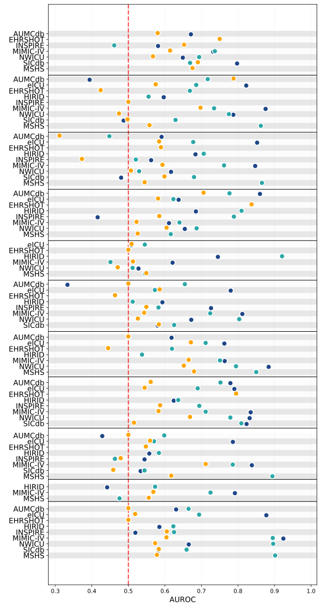
</div>
:::
::: {.column width="50%"}
<div style=" margin-top: -2em;">
  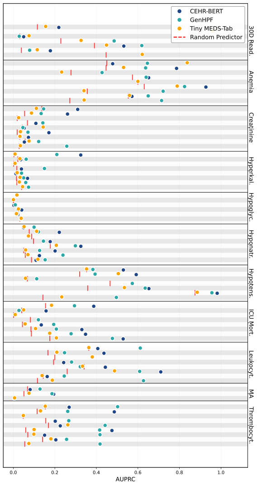
</div>
:::
:::

::: {.notes}
- Each point represents a model trained and evaluated at a specific site, with the same task definition
- The spread of points across sites for the same model and task highlights the variability in performance due to differences in data and implementation, underscoring the need for standardized benchmarking.
- The overall performance trends across models and tasks can be compared, but the variability emphasizes that results from one site may not generalize to others without careful validation.
:::

## Scaling Up Clinical ML from Cohorts to Health Systems

{fig-cap="" width=100% .no-dark}

## Linear Probing
- Train a linear classifier on top of frozen foundation model representations
<div style="text-align: center;">

  
</div>

::: {.fragment}

- CEHR-XGPT^[[@pangCEHRXGPTScalableMultiTask2025]] and MOTOR^[[@steinbergMOTORTimetoEventFoundation2023a]] Leukocytis embeddings colored by task labels (<span style="color:#BCAD76;">positive</span>/<span style="color:#4A556C;">negative</span>):

::: {.columns}
::: {.column width="50%"}
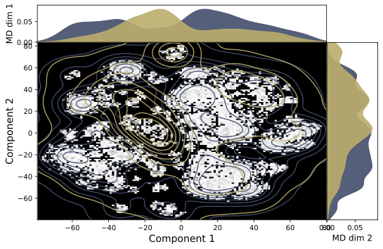
:::

::: {.column width="50%"}
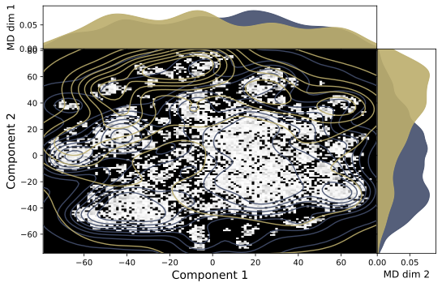
:::
:::
:::


:::


## Impact of the MEDS Ecosystem

<div style="text-align: center;">
  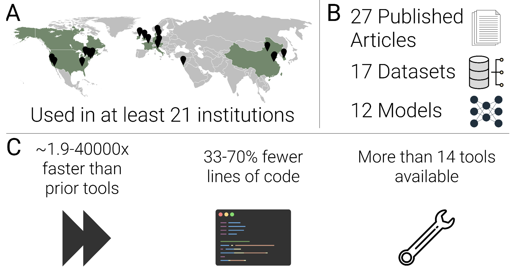
</div>
::: {.tiny-text}
  Adapted from McDermott et al. "MEDS: An Emerging Data Standard and Ecosystem for Health AI Research" Provisionally accepted to NEJM AI (2026)
:::
<!-- - Supported the development of SOTA models for EHR data ^[[@pangCEHRXGPTScalableMultiTask2025;@fallahpourEHRMambaGeneralizableScalable2024a; @rencFoundationModelElectronic2025]]. -->
<!-- - 21 institutions
- $>$ 27 academic papers and preprints
- 17 datasets
- 12 AI algorithms
- Reduction of lines of code up to 70% -->


## Limitations

::: {.incremental}
- Models may amplify existing (historical) racial, gender, and socioeconomic biases if not carefully validated
- Randomized controlled trials are needed to demonstrate clinical utility and safety before deployment
- Can be used for harmful purposes (e.g., insurance discrimination, surveillance, etc.)
- (Large) AI models can have sizeable environmental impact; simpler is better
:::

## My Thesis

We require:

::: {.incremental}
1. **Transparent benchmarking frameworks**: to understand what actually drives model performance
2. **Prospective clinical studies**: to improve quality and validate assumptions from retrospective research
3. **Standardized infrastructure**: to enable collaborative, reproducible research at scale


**The Thesis Summarized:**
*Healthcare ML requires prospective data collection, experimental infrastructure, and institutional commitment to reproducibility.*
::: 


## Future Research Directions

::: {.incremental}
- Multi-modal fusion for FMs; off-the-shelf FMs or health system specific^[[@burkhartFoundationModelsElectronic2025a]] ?
  - Pathology, radiology, genomics, etc.
  - Focus on generalizability justified?^[[@futomaMythGeneralisabilityClinical2020a; @vancalsterThereNoSuch2023]]
- Scaling up health AI: how does performance improve with more data, compute, and model size?^[[@waxlerGenerativeMedicalEvent2025; @zhangExploringScalingLaws2025; @huangOverTokenizedTransformerVocabulary2025]]
- Improving care by:
  - Predictive surveillance (e.g., scheduling mammograms based on risk)
  - Patient representations across disciplines (e.g., oncology, cardiology, etc.)^[[@kernCareFragmentationCare2024]]
:::

---

## United Nations WHO Digital Health Objectives

::: {.centered}
{fig-cap="World Health Organization" height=5em .no-dark}
:::

::: {.bigger-text}

::: {.fragment .fade-in fragment-index=1}

::: {.fragment .highlight-green fragment-index=5}
   - Promote global collaboration & advance the transfer of knowledge on digital health
:::
::: 
::: {.fragment .fade-in fragment-index=2}
   - Advance the implementation of national digital health strategies
:::
::: {.fragment .fade-in fragment-index=3}
   - Strengthen governance for digital health at global, regional and national levels
:::
::: {.fragment .fade-in fragment-index=4}
   - Advocate people-centered health systems that are enabled by digital health
:::

:::
::: {.notes}
In my thesis we focus on 1 in particularly while respecting and complementing the other objectives; of which the latter 3 and 4 are most important.
- https://www.itu.int/en/ITU-T/Workshops-and-Seminars/2024/0509/Documents/Carl%20LEITNER.pdf 
:::


---

## Acknowledgements

::: {.columns}
::: {.column width="25%"}
HPI:

- Christoph Lippert
- Lothar Wieler
- Felix Naumann
- Gerard de Melo
- Bert Arnrich
- Hendrik Schmidt
- Edit Tatar
- Katharina Lorenz-Shroeder
:::
::: {.column width="25%"}
Charité:

- Max M. Maurer
- Axel Winter
- Daniela Zuluaga Lotero
:::
::: {.column width="25%"}
Mentors and Collaborators:

- Patrick Rockenschaub (Medical University of Vienna)
- Matthew McDermott (Columbia University)
- Eugenia Alleva (Mount Sinai)
:::
::: {.column width="25%"}
Reviewers:

- Padhraic Smyth (UC Irvine)
- Mykola Pechenizkiy (TU Eindhoven)
:::
:::

<!-- The field of machine learning for healthcare stands at an inflection point. We have:
- ✓ Demonstrated predictive capability (models work in controlled settings)
- ✓ Shown deployment is feasible (CASSANDRA, clinical partnerships)
- ✓ Built reusable infrastructure (MEDS ecosystem)

**What Remains:**
- Translating research into routine clinical practice (workflow integration)
- Ensuring equitable deployment across diverse healthcare systems
- Maintaining humility about what ML can and cannot do in healthcare -->

<!-- ## Thank You -->

<!-- *Key Takeaways:*
1. Reproducibility framework (YAIB) reveals that experimental setup often matters more than model choice
2. Prospective validation (CASSANDRA) shows what works in reality, not just in retrospective analysis
3. Standardized data format (MEDS) enables community collaboration and faster scientific progress -->

<!-- *Broader Vision:*
Healthcare ML can improve outcomes when built on solid infrastructure, rigorous validation, and commitment to reproducibility. -->


## References

::: {#refs}
:::

<!--  -->
